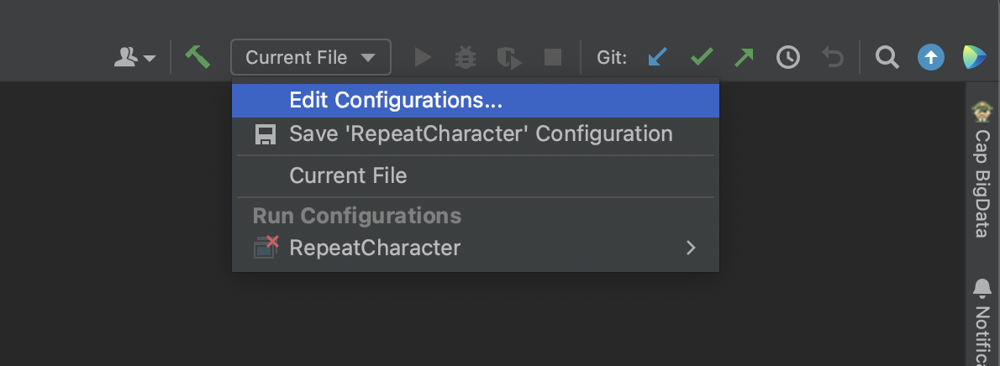
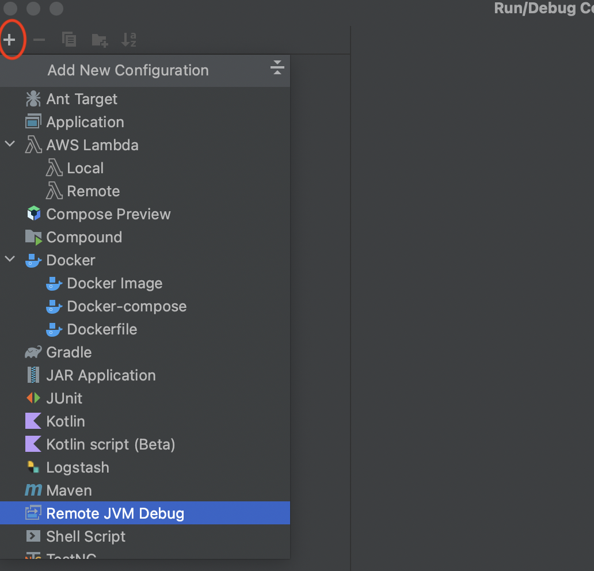
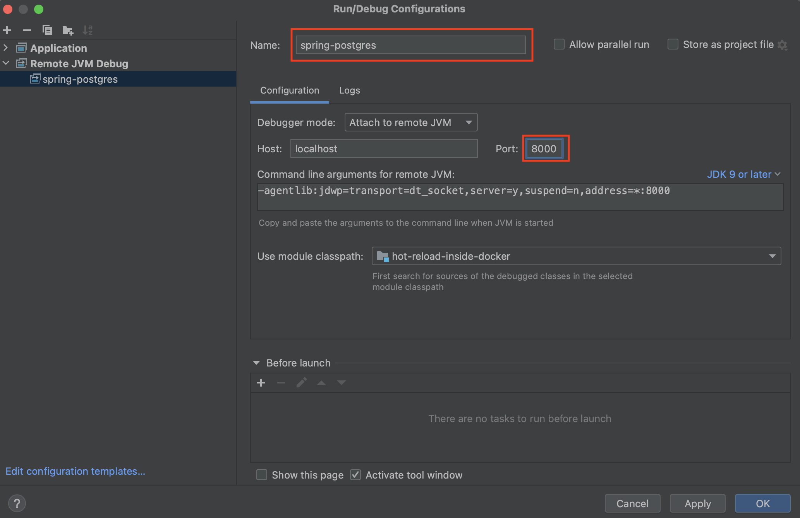

# hot-reload-inside-docker

If you're looking to run a SpringBoot or Micronaut application inside docker with hot reload then
you can use this repo.

<video width="320" height="240" controls>
  <source src="./resources/hot-reload-inside-docker-video.mp4" type="video/mp4">
</video>

### Outcomes

- Application built inside docker.
- Code changes are auto-compiled and updated without having to restart the app or container.
- Remote debugging using IntelliJIDEA.

## Explanation

Run the application first time by hitting run button in IDE. While application is running, change
code base by adding some `System.out.println` statement and save the changes. This time code changes
should be auto-compiled and updated without having to restart the application(hot reload).

Most of the frameworks itself does support this feature. Use some file watcher tools
like [modd](https://github.com/cortesi/modd) if framework doesn't support hot reload by default.

To have same behaviour inside docker we have created `Dockerfile` and `docker-compose.yml` templates
for the java related technologies like SpringBoot and Micronaut:

| Framework      | Database |                                   |  |
|----------------|----------|-------------------------------------------------------------------------------------------------------------|-------|
| __SpringBoot__ | postgres | [](./spring-postgres)    |[](./spring-postgres)|
| __Micronaut__  | postgres | [](./micronaut-postgres) | [](./micronaut-postgres)|

Click on  icon
based on framework and build tool used in project to navigate to specific docker files.

## Quick Comparison

| Framework |Feature |                                                    ||
|----------|-----|------------------------------------------------------------------------------------------------------------------------------|-----|
| SpringBoot |hot-reload| __step-1:__ Add `spring-boot-devtools` dependency to `pom.xml`. </br> __step-2:__ Run `./mvnw spring-boot:run` inside working directory. | __step-1:__ Add `org.springframework.boot:spring-boot-devtools` dependency to `build.gradle`. </br> __step-2__: Run `./gradlew bootRun` inside working directory.|
|          |remote-debugging| Just run the command `./mvnw spring-boot:run -Dspring-boot.run.jvmArguments="-agentlib:jdwp=transport=dt_socket,server=y,suspend=n,address=*:8000"` inside working directory. | __step-1:__ Add task </br>`bootRun { jvmArgs=["-agentlib:jdwp=transport=dt_socket,server=y,suspend=n,address=*:8000"] }`</br> to `build.gradle`</br></br> __step-2__: Run `./gradlew bootRun` inside working directory.|
|Micronaut|hot-reload| Run `./mvnw mn:run -Dmn.watch=true` inside working directory                                                                 | Run `./gradlew run -t` inside working directory, Here `-t` enables continious build.|
|          |remote-debugging| Just run the command `./mvnw mn:run -Dmn.debug -Dmn.debug.host=* -Dmn.debug.port=8000` inside working directory.| __step-1:__ Add task </br>`run { jvmArgs=["-agentlib:jdwp=transport=dt_socket,server=y,suspend=n,address=*:8000"] }`</br> to `build.gradle`</br></br> __step-2__: Run `./gradlew run -t` inside working directory.

## Remote Debugging Using IntelliJIDEA

__Step-1:__ Click on __Edit Configuration__ in IntelliJIDEA



__Step-2:__ Click on `+` button and select `Remote JVM Debug`



__Step-3:__ Change debugger __Name__ and __Port__ and click on __Apply__.



__Step-4:__ Run the
command `./mvnw spring-boot:run -Dspring-boot.run.jvmArguments="-agentlib:jdwp=transport=dt_socket,server=y,suspend=n,address=*:8000"`
inside
working directory.

Then logs of application is:

```
...
[INFO] Attaching agents: []
Listening for transport dt_socket at address: 8000
20:31:03.470 [Thread-0] DEBUG org.springframework.boot.devtools.restart.classloader.RestartClassLoader - Created RestartClassLoader org.springframework.boot.devtools.restart.classloader.RestartClassLoader@14b1ba40

  .   ____          _            __ _ _
 /\\ / ___'_ __ _ _(_)_ __  __ _ \ \ \ \
( ( )\___ | '_ | '_| | '_ \/ _` | \ \ \ \
 \\/  ___)| |_)| | | | | || (_| |  ) ) ) )
  '  |____| .__|_| |_|_| |_\__, | / / / /
 =========|_|==============|___/=/_/_/_/
 :: Spring Boot ::                (v2.7.2)
 ...
```

If you observe the log `Listening for transport dt_socket at address: 8000`, that means application
is running in debug mode at port __8000__. Then
click  debug
button in __IntelliJIDEA__, you should see
log `Connected to the target VM, address: 'localhost:8000', transport: 'socket'` in debugger panel.

Now you can set a debug point inside __Controller__, and hit an API that goes to that debug
point using Postman, you can see you'll be redirected to __IntelliJ__ by stopping the execution at
debug point.
